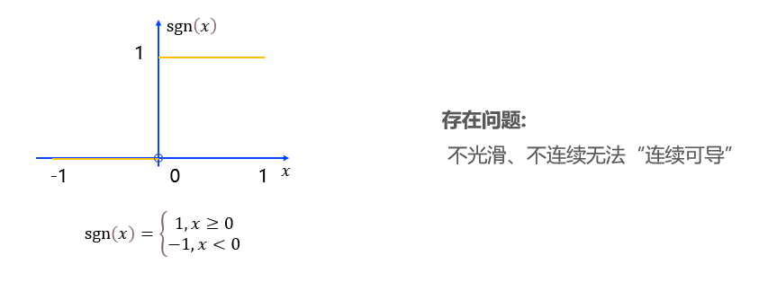
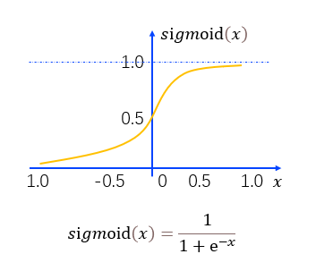

#### 阶跃函数

* 阶跃函数: 可以将神经元输入值与阈值的差值映射为输入值1或0. 若差值大于等于零则输出1, 对应兴奋; 若差值小于零则输出0, 对应抑制.



* 神经元的工作模型存在"激活(1)"和"抑制(0)"两种状态的跳变, 那么理想的激活函数就应该是图中所示的阶跃函数(Step Function, 阶跃函数是一种特殊的连续时间函数, 是一个从0跳变到1的过程, 属于奇异函数). 阶跃函数可以将神经元输入值与阈值的差值映射为输出值1或0; 若差值大于等于零则输出1, 对应兴奋; 若差值小于零则输出0, 对应抑制.

* 但事实上, 在实际使用中, 阶跃函数具有不光滑、不连续等众多不友好的特性, 使用的并不广泛. 说他不友好的原因是, 在神经网络中训练网络权重时, 通常依赖对某个权重求偏导、寻极值, 而不光滑、不连续等通常意味着该函数无法连续可导.

```python

```

* S型函数(Sigmoid函数): 无论输入值的范围有多大, 这个函数都可以将输出挤压在范围(0, 1)之内.



* 因此, 我们通常用S型函数来代替阶跃函数, 最常用的S型函数为Sigmoid函数. 在Sigmoid函数中, 无论输出值的范围有多大, 这个函数都可以将输出挤压在范围(0, 1)之内, 因此这个函数又被称为挤压函数(Squashing Function). 这样, 如果输入的值在(0, 0.5)之间, 那么对于Sigmoid函数, 则输出大于0.5小于1, 对应兴奋; 如果输入值在(-0.5, 0)之间, 那么输出则小于0.5大于0, 对应抑制.

```python

```