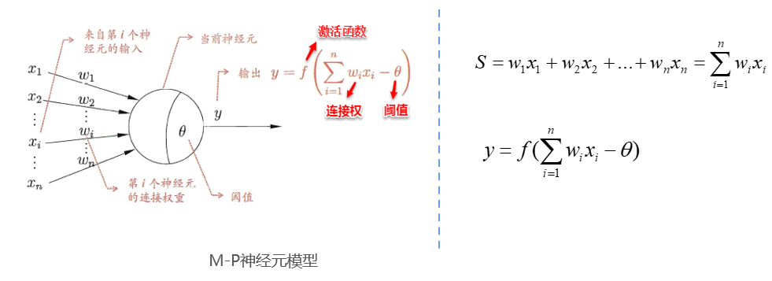

#### M-P神经元模型

* M-P神经元模型是一种数学模型,用于描述生物神经元的工作原理.这一模型由神经科学家Warren McCulloch和数学家Walter Pitts于1943年提出,是神经网络和人工神经元的起点.

* M-P神经元模型简化了生物神经元的工作原理,将其表示为输入信号的线性组合,并在达到某一阈值后输出二进制信号(激活或不激活).这一模型对于理解神经元如何处理信息以及构建神经网络具有重要意义.

* 需要注意的是,M-P神经元模型相对简单,不考虑生物神经元的所有复杂性,如突触权重的变化和非线性响应.



* 在这一模型中,神经元接受来自各个其他神经元传递过来的输入信号.这些信号的表达,通常通过神经元之间连接的权重(Weight)大小来表示,神经元将接收到的输入值按照某种权重叠加起来.

* 从公式可以看出,当前神经元按照某种"轻重有别"的方式,汇集了所有其他外联神经元的输入,并将其作为一个结果输出.但这种输出,并非直接输出,而是与当前神经元的阈值进行比较,然后通过激活函数(Activation Function)向外表达输出,在概念上这就叫感知机(Perception).可以看出M-P模型就是一个加权求和再激活的过程,能够完成线性可分的分类问题.

```python
# 以经典乳腺癌为例
import numpy as np
import pandas as pd
import matplotlib.pyplot as plt
import sklearn.datasets
from sklearn.metrics import accuracy_score # 以准确率为评价指标
from sklearn.model_selection import train_test_split # 用来分割数据集
from sklearn.datasets import load_breast_cancer # 导入数据集

# 分离特征和标签, 1表示良性, 0表示恶性
breast_cancer = sklearn.datasets.load_breast_cancer()
data = pd.DataFrame(breast_cancer.data, columns=breast_cancer.feature_names)
data['class'] = breast_cancer.target
data['class'].value_counts()
X = data.drop('class', axis=1)
y = data['class']

# 数据集划分
#划分数据集和测试集, 测试集的大小为总体数据的15%, 设置stratify=y
# 按照数据集中y的比例分配给train和test, 使得train和test中格列别数据的比例一致, 通常在数据集的分类分布不平衡的情况下会用到stratify
X_train, X_test, y_train, y_test = train_test_split(X, y, test_size=0.15, stratify=y, random_state=0)
# M-P神经元模型仅能把0或1作为输入, 所以我们要把数据进行处理, 划分为0和1两类
X_binarise_train = X_train.apply(pd.cut, bins=2, labels=[1, 0])
X_binarise_test = X_test.apply(pd.cut, bins=2, labels=[1, 0])
# 获取value, 用数组进行计算
X_binarise_train = X_binarise_train.values
X_binarise_test = X_binarise_test.values

# 构建M-P神经元类
class MPNeuron:
    def __init__(self):
        self.b = None

    def model(self, x):
        return (sum(x) >= self.b)

    def predict(self, X):
        y = []
        for x in X:
            y.append(self.model(x))
        return np.array(y)

    def fit(self, X, y):
        accuracy = {}
        for b in range(X.shape[1] + 1):
            self.b = b
            y_pred = self.predict(X)
            accuracy[b] = accuracy_score(y_pred, y)

        best_b = max(accuracy, key = accuracy.get)
        self.b = best_b
        # 打印最佳b值和最高准确率
        print('best_b:', best_b)
        print('best_accuracy:', accuracy[best_b])

# 用M-P神经元训练, 机器学习叫做fit, 深度学习叫做train
mp_neuron = MPNeuron()
mp_neuron.fit(X_binarise_train, y_train)
# 打印accuracy_score
w = mp_neuron.predict(X_binarise_test)
accuracy_score(w, y_test)
```